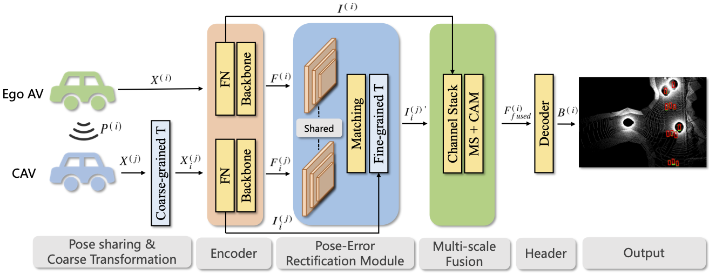

# FeaCo
The official implementation of ACM MM2023 paper "FeaCo: Reaching Robust Feature-Level Consensus in Noisy Pose Conditions".


> [**FeaCo: Reaching Robust Feature-Level Consensus in Noisy Pose Conditions**](https://doi.org/10.1145/3581783.3611880),            
> Jiaming Gu\*, Jingyu Zhang\*, Muyang Zhang, Weiliang Meng, Shibiao Xu, Jiguang Zhang, Xiaopeng Zhang <br>
> *Accepted by ACM MM 2023*

# Abstract
Collaborative perception offers a promising solution to overcome challenges such as occlusion and long-range data processing. However, limited sensor accuracy leads to noisy poses that misalign observations among vehicles. To address this problem, we propose the FeaCo, which achieves robust Feature-level Consensus among collaborating agents in noisy pose conditions without additional training. We design an efficient Pose-error Rectification Module (PRM) to align derived feature maps from different vehicles, reducing the adverse effect of noisy pose and bandwidth requirements. We also provide an effective multi-scale Cross-level Attention Module (CAM) to enhance information aggregation and interaction between various scales. Our FeaCo outperforms all other localization rectification methods, as validated on both the collaborative perception simulation dataset OPV2V and real-world dataset V2V4Real, reducing heading error and enhancing localization accuracy across various error levels.

<!-- # Note
The code will be released after the publication of the subsequent work. -->

## Installation
```bash
# Setup conda environment
conda create -f Env.yaml

conda activate opencood

# spconv 2.0 install, choose the correct cuda version for you
pip install spconv-cu113

# Install dependencies
pip install -r requirements.txt
# Install bbx nms calculation cuda version
python v2xvit/utils/setup.py build_ext --inplace

# install v2xvit into the environment
python setup.py develop
```

## Data Downloading
All the data can be downloaded from [google drive](https://drive.google.com/drive/folders/1dkDeHlwOVbmgXcDazZvO6TFEZ6V_7WUu). If you have a good internet, you can directly
download the complete large zip file such as `train.zip`. In case you suffer from downloading large files, we also split each data set into small chunks, which can be found 
in the directory ending with `_chunks`, such as `train_chunks`. After downloading, please run the following command to each set to merge those chunks together:
```python
cat train.zip.part* > train.zip
unzip train.zip
```

## Getting Started

### Note:

- Models and parameters should be trained in perfect environment and tested in noisy environment.

### Test with pretrained model
To test the pretrained model of FeaCo, first download the model file from [google url](https://drive.google.com/drive/folders/1reQ7I3jNWRosjpEhVGSSKE2JoLwHIHa4?usp=sharing) and
then put it under v2xvit/logs/opv2v_feaco. Change the `validate_path` in `v2xvit/logs/opv2v_feaco/config.yaml` as `/data/opv2v/test`.

To test under perfect setting, change `add_noise` to false in the v2xvit/logs/opv2v_feaco/config.yaml.

To test under noisy setting in our paper, change the `noise_settings` as followings:
```
noise_setting:
  add_noise: True
  args: 
    pos_std: 1
    rot_std: 1
    pos_mean: 0
    rot_mean: 0
```
Eventually, run the following command to perform test:
```python
python v2xvit/tools/inference.py --model_dir ${CHECKPOINT_FOLDER}
```
Arguments Explanation:
- `model_dir`: the path of the checkpoints, e.g. 'v2xvit/logs/opv2v_feaco' for FeaCo testing.

### Train your model
FeaCo uses yaml file to configure all the parameters for training. To train your own model
from scratch or a continued checkpoint, run the following commands:

```python
python v2xvit/tools/train.py --hypes_yaml ${CONFIG_FILE} [--model_dir  ${CHECKPOINT_FOLDER} --half]
```
Arguments Explanation:
- `hypes_yaml`: the path of the training configuration file, e.g. `v2xvit/hypes_yaml/where2comm_transformer_multiscale_resnet.yaml` for FeaCo training.
- `model_dir` (optional) : the path of the checkpoints. This is used to fine-tune the trained models. When the `model_dir` is
given, the trainer will discard the `hypes_yaml` and load the `config.yaml` in the checkpoint folder.
- `half`(optional): if specified, hybrid-precision training will be used to save memory occupation.

## Citation
 If you are using our FeaCo for your research, please cite the following paper:
 ```bibtex
@inproceedings{gu2023feaco,
  title={FeaCo: Reaching Robust Feature-Level Consensus in Noisy Pose Conditions},
  author={Gu, Jiaming and Zhang, Jingyu and Zhang, Muyang and Meng, Weiliang and Xu, Shibiao and Zhang, Jiguang and Zhang, Xiaopeng},
  booktitle={Proceedings of the 31st ACM International Conference on Multimedia},
  pages={3628--3636},
  year={2023}
}
```

## Acknowledgment
FeaCo is built upon [OpenCOOD](https://github.com/DerrickXuNu/OpenCOOD) and [V2X-ViT](https://github.com/DerrickXuNu/v2x-vit). 
